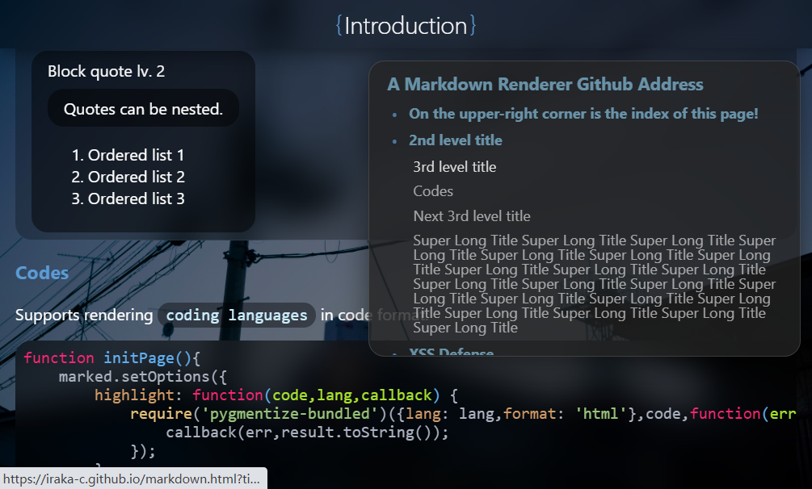
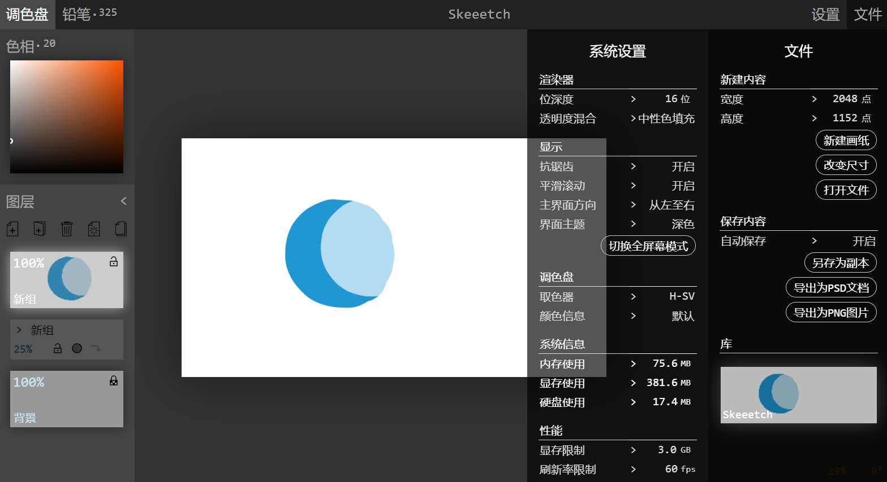
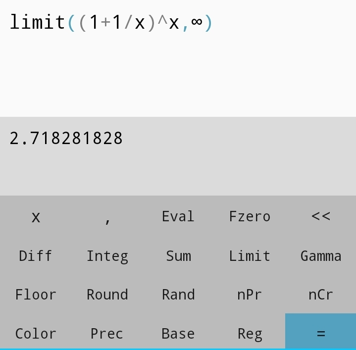
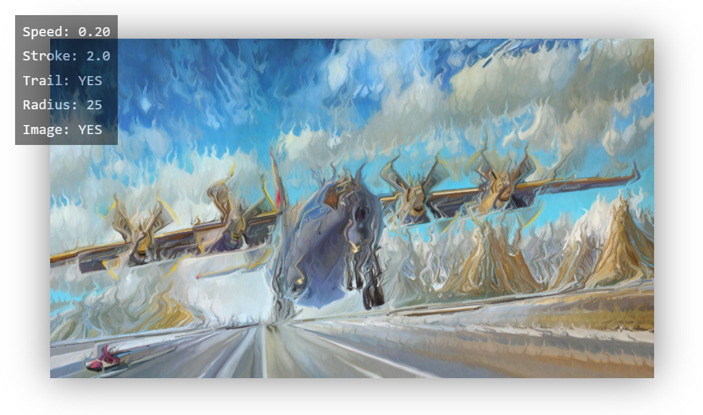
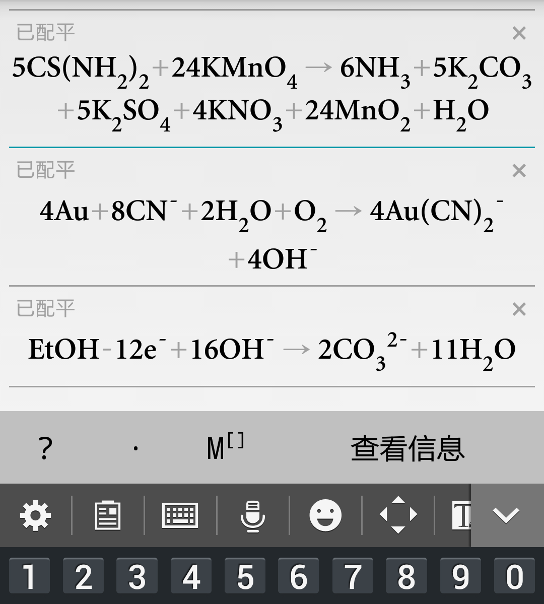

# Gadgets

[Homepage](*//iraka-c.github.io)

## Application Design

| Name                                                         | Sample                                                       | Introduction                                                 |
| ------------------------------------------------------------ | ------------------------------------------------------------ | ------------------------------------------------------------ |
| [Markdown Renderer](https://github.com/Iraka-C/Iraka-C.github.io) |  | **This page is also displayed with this renderer!** Serves as the underlying parser and renderer for my personal site, but you may also use it to display and customize any `.md` online. |
| [Skeeetch](https://github.com/Iraka-C/Skeeetch/blob/master/gl/docs/zh/readme.md) |  | A WebGL-based sketch pad application for illustrators. This application is based on HTML5 web technologies. Try it [HERE](https://iraka-c.github.io/Skeeetch)! |
| [Calci](https://coolapk.com/apk/com.iraka.calci)             |  | An Android calculator application with minimalistic designs and numerical functions support. The algorithmic core is [open sourced](https://github.com/Iraka-C/Calci-kernel). |
| [Screen](https://github.com/laurence-ling/screen)            | <video controls width="400"><source src="../resources/gadgets-intro/screen-demo.mp4"></video> | An Android application that displays and manipulates an image across several smartphone screens in arbitrary spatial arrangement. Multi-touch gestures (pan, zoom, rotate) supported. |
| [Mega Impressionistic](https://github.com/Iraka-C/Mega-Impressionistic) |  | A Web application that turns any image into a dynamic impressionistic look. Try it [HERE](https://iraka-c.github.io/Mega-Impressionistic)! |
| [Equa](https://www.coolapk.com/apk/com.iraka.chemeq)         |  | An Android calculator application that balances a chemical equation. Useful when doing calculation during simple experiments. NOT open-source. |

## Graphics Design

Under construction

